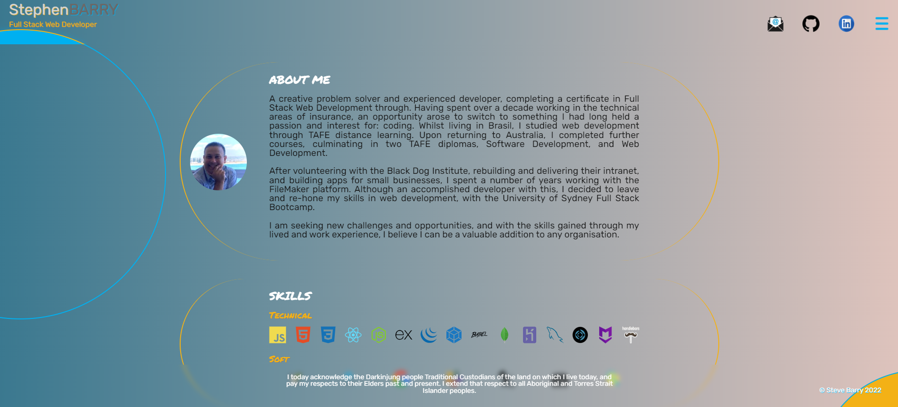

## Portfolio - Steve Barry

##  The Task

The task was to update our portfolio to be rebuilt using React.js

### ⭐ ⭐ S.T.A.R. ⭐ ⭐

**SITUATION**

Previous iterations have all been built with a standard HTML backbone. This assignment was to rebuilding using the React.js framework.

**TASK**

Provide a portfolio that demonstrates our technical skills, as well as our design skills, and links to our professional profiles and work. 

**ACTION**

Writing of a solution to resolve the situation, including:
* Layout
  * *Layout is responsive and functional on various screen sizes*
  * *Polished and attractive design*
  * *Background fade follows mouse movement*
  * *Gently moving parts to give a relaxed look and feel*
  * *Sections borders narrowed for a more accented look*
  * *Logical layout*
  * *Improved code visualisation*
  * *Error free loading*
  * *Favicon designed and added*
  * *Thorough comments*
  * *Intuitive design*
* Javascript
  * *Built with the React.js framework*
  * *Error free performance*
  * *Multiple functions to separate aspects of code*
  * *Thorough comments*
* Employer Ready
  * *Updated and streamlined resume*
  * *LinkedIn updated*
  * *Github updated* 
* GIT
  * *Numerous commits to track changes in code*
  * *Code added to public repository and Github Pages for public viewing*
* Functionality
  * *Deployed to Heroku for future MongoDb integration to complete the MERN stack*
  * *Users are presented with a responsive list of projects and repos*
  * *Users can preview an application by clicking on an image,this will bring up a modal screen with a preview of the page, together with links to the deployed application and the repo*
  * *Multiple ways to contact me, including a downloadable resume and a link to an online copy*

**RESULT**

The end code is stored on Github, deployed on Heroku, and publicly available and viewable. This result meets all requirements set out.

##  The Outcome

As all items stipulated in the assignment document are completed, the task is now complete. 

You can view the finished product [HERE](https://nbs-portfolio.herokuapp.com/)

Alternatively, here is a screenshot:

> 

---

Written by Steve Barry - Due date 28/4/2022

© 2022 Trilogy Education Services, LLC, a 2U, Inc. brand. Confidential and Proprietary. All Rights Reserved.

